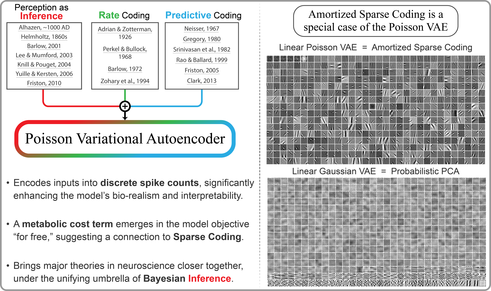

## The Official PyTorch Implementation of "Poisson Variational Autoencoder" ([NeurIPS 2024 Spotlight Paper](https://openreview.net/forum?id=ektPEcqGLb))

Welcome to the *"Poisson Variational Autoencoder"* (P-VAE) codebas! P-VAE is a brain-inspired generative model that unifies major theories in neuroscience with modern machine learning.



When trained on whitened natural image patches, the P-VAE learns sparse, "Gabor-like" features.


This is significant because if you stick an electrode into the primary visual cortex and record from actual neurons, this is the type of selectivity you would observe. Remarkably, the P-VAE develops a similar selectivity in a purely unsupervised manner, despite never being exposed to data from real neurons.

## 1. Code Structure

- **`./main/`**: Full architecture and training code for all four VAEs, including the P-VAE, reproducing paper results.
- **`./base/distributions.py`**: Distributions used in the paper, including Poisson with our novel reparameterization algorithm.
- **`./analysis/`**: Data analysis and result generation code.
- **`./scripts/`**: Model fitting scripts (examples below).

### Stand-alone PyTorch Lightning Implementation

We also provide a minimal PyTorch Lightning implementation of the P-VAE, stripped down to its essential components. This serves as an excellent starting point for understanding the model. Check it out:

<a target="_blank" href="https://colab.research.google.com/drive/1PBeAv-3kcrwrSBKzRxDCcDiaxyC0-8Xv?usp=sharing">
  
</a>


## 2. Training a VAE

To train a model, run:

```bash
cd scripts/
./fit_vae.sh <device> <dataset> <model> <archi>
```

### Arguments:
- **`<device>`**: `int`, CUDA device index.
- **`<dataset>`**: `str`, choices = `{'vH16', 'CIFAR16', 'MNIST'}`.
- **`<model>`**: `str`, choices = `{'poisson', 'categorical', 'gaussian', 'laplace'}`.
- **`<archi>`**: `str`, architecture format = `{'lin|lin', 'conv+b|lin', 'conv+b|conv+b'}` (interpreted as `enc|dec`).

In the paper, we refer to `'vH16'` and `'CIFAR16'` options as "van Hateren" and "CIFAR_16x16", respectively. In earlier versions of the code, the van Hateren dataset was also called DOVES. Therefore, vH16, van Hateren, and DOVES are interchangeable.

See `./main/train_vae.py` for additional arguments. For example, you can set latent dimensionality to $K = 1024$, and KL/reconstruction trade-off to $\beta = 2.5$, like this:

```bash
./fit_vae.sh <device> <dataset> <model> <archi> --n_latents 1024 --kl_beta 2.5
```

## 3. Notebook to Generate Results

- **`results.ipynb`**: Generates all VAE-related tables and figures from the paper.
- **`results_lca.py`**: Generates sparse coding results.

## 4. Model Checkpoints and Data

### Checkpoints

We provide four linear VAE model checkpoints trained with:

```bash
./fit_vae.sh 0 'vH16' <model> 'lin|lin'
```

Checkpoints are located in **`./checkpoints/`** and can be loaded/visualized using **`load_models.ipynb`**. If additional model checkpoints would be helpful, feel free to reach out.

### Data

Download the processed datasets from the following links:

- Complete folder: [Drive Link](https://drive.google.com/drive/folders/1mCrsYtxcbNODcCTCLdaTi5v8yN_n5AMA?usp=sharing).
- Or individual datasets:
    1. [van Hateren](https://drive.google.com/drive/folders/1zaQPZm-8LhRXA24wMj4JeJf3s7Z0iIkM?usp=sharing).
    2. [CIFAR_16x16](https://drive.google.com/drive/folders/1q0TAKHxaEfRfU0YwgykD8TTiYhCpZ400?usp=sharing).
    3. [MNIST](https://drive.google.com/drive/folders/1WQVqoUU1vbNTs4fd5jgA3zZR1j_XN3cC?usp=sharing).

Place the downloaded data under **`~/Datasets/`** with the following structure:

1. `~/Datasets/DOVES/vH16`
2. `~/Datasets/CIFAR16/xtract16`
3. `~/Datasets/MNIST/processed`

For details, see the ```make_dataset()``` function in **`./base/dataset.py`**.

## 5. Citation

If you use our code in your research, please cite our paper:

```bibtex
@inproceedings{vafaii2024poisson,
    title={Poisson Variational Autoencoder},
    author={Hadi Vafaii and Dekel Galor and Jacob L. Yates},
    booktitle={The Thirty-eighth Annual Conference on Neural Information Processing Systems},
    year={2024},
    url={https://openreview.net/forum?id=ektPEcqGLb},
}
```

## 6. Contact

- For code-related questions, please open an issue in this repository.
- For paper-related questions, contact me at [vafaii@berkeley.edu](mailto:vafaii@berkeley.edu).
